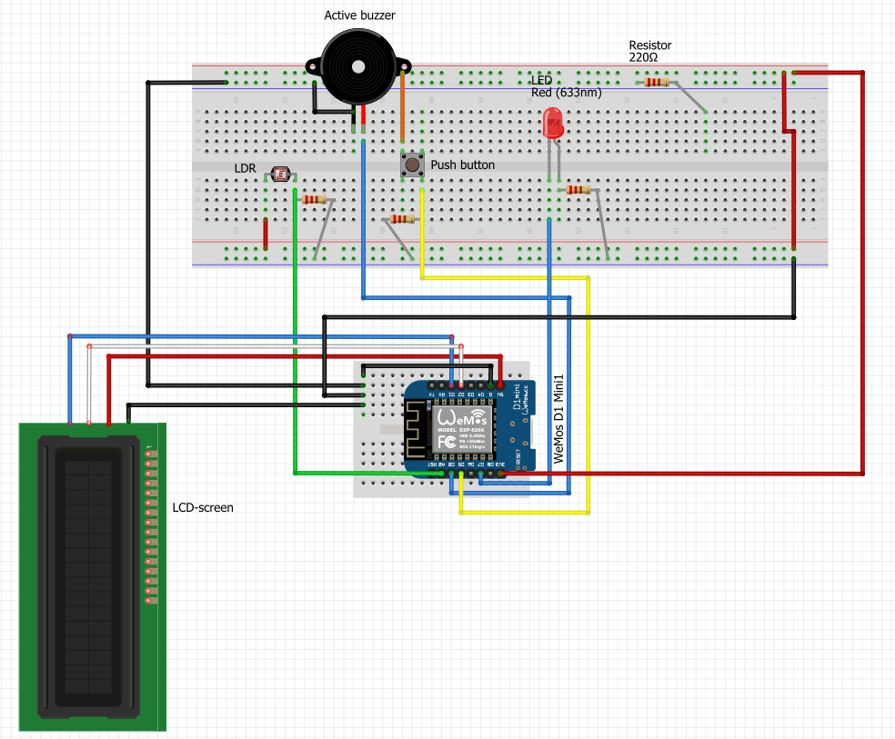

# Technical documentation

Your Wiring Diagram, Bill of Materials, ... everything about how you built your embedded device should be documented here.

Below you will find the Bill of Materials of my own project. This is made for others who want to recreate my project and 
need references to all the materials I used. 

| **Part#**    | **Manufacturer**             | **Description**                                  | **Quantity** | **Price (incl. VAT)** | **Subtotal (incl. VAT)** | **Example url**                                                                                                                                                                                                                                                                                                                                                                                                                                                                                                                                                                                                                                                                                                 |
|--------------|------------------------------|--------------------------------------------------|--------------|-----------------------|--------------------------|-----------------------------------------------------------------------------------------------------------------------------------------------------------------------------------------------------------------------------------------------------------------------------------------------------------------------------------------------------------------------------------------------------------------------------------------------------------------------------------------------------------------------------------------------------------------------------------------------------------------------------------------------------------------------------------------------------------------|
| WMD1MINIV4   | Lolin                        | WeMos D1 mini V4.0 ESP-8266EX                    | 1            | 6,30                  | 6,30                     | https://opencircuit.nl/product/wemos-d1-mini-v4.0-wifi-module                                                                                                                                                                                                                                                                                                                                                                                                                                                                                                                                                                                                                                                   |
 | C1-02-01-LCD | Hitachi                      | 2x16 LCD Display                                 | 1            | 8,90                  | 8,90                     | https://www.leds-buy.nl/componenten/displays/lcd-displays/2x16-lcd-display                                                                                                                                                                                                                                                                                                                                                                                                                                                                                                                                                                                                                                      |
 | 5528         | EXCELITAS TECH               | LDR light dependent resistor                     | 1            | 0,25                  | 0,25                     | https://www.hobbyelectronica.nl/product/ldr-light-dependent-resistor/                                                                                                                                                                                                                                                                                                                                                                                                                                                                                                                                                                                                                                           |
 | L-53LGD      | KINGBRIGHT                   | LED 5MM 2MA GN                                   | 1            | 0,15                  | 0,15                     | https://www.reichelt.nl/nl/nl/led-5-mm-gekleurd-3-2-mcd-laagvermogen-groen-led-5mm-2ma-gn-p21625.html?PROVID=2809&gad_source=1&gclid=Cj0KCQjwncWvBhD_ARIsAEb2HW9FZjfCsen7l3jQZWbesbOsnBqB1ovnom8DPjzlEgniSZ0krAV3FjoaAoseEALw_wcB                                                                                                                                                                                                                                                                                                                                                                                                                                                                               |
 | A000066      | Arduino                      | Arduino UNO R3 incl. USB kabel en header pins.   | 1            | 6,99                  | 6,99                     | https://www.otronic.nl/nl/uno-r3-arduino-compatible-incl-usb-kabel-en-header.html?source=googlebase&gad_source=1&gclid=Cj0KCQjwqdqvBhCPARIsANrmZhNvKoSLyTJDJtku4f0Q6-ukZb6lYnQU7loOmPy26DCzZgzbxHREqUwaAuQMEALw_wcB                                                                                                                                                                                                                                                                                                                                                                                                                                                                                             |
 | -            | KIMISS                       | Active buzzer 5V                                 | 1            | 0,49                  | 0,49                     | https://www.benselectronics.nl/active-buzzer-pieper-5-volt.html?source=googlebase&gad_source=1&gclid=Cj0KCQjwqdqvBhCPARIsANrmZhMsItqdo_xtTbT4Wn4L8BOq1VBXjQB16BPDhh8mBsbV_7sS6AXHrs8aAsMzEALw_wcB                                                                                                                                                                                                                                                                                                                                                                                                                                                                                                               |
 | MC001795     | MULTICOMP                    | Breadboard 830 points                            | 1            | 4,00                  | 4,00                     | https://www.tinytronics.nl/nl/gereedschap-en-montage/prototyping-toebehoren/breadboards/breadboard-830-points                                                                                                                                                                                                                                                                                                                                                                                                                                                                                                                                                                                                   |
 | MP006284     | MULTICOMP PRO                | DuPont Jumper draad Female-Female 10cm 10 draden | 4            | 0,50                  | 2,00                     | https://www.tinytronics.nl/nl/kabels-en-connectoren/kabels-en-adapters/prototyping-draden/dupont-compatible-en-jumper/dupont-jumper-draad-female-female-10cm-10-draden                                                                                                                                                                                                                                                                                                                                                                                                                                                                                                                                          |
 | MP006282     | MULTICOMP PRO                | DuPont Jumper draad Male-Male 10cm 10 draden     | 2            | 0,50                  | 1,00                     | https://www.tinytronics.nl/nl/kabels-en-connectoren/kabels-en-adapters/prototyping-draden/dupont-compatible-en-jumper/dupont-jumper-draad-male-male-10cm-10-draden                                                                                                                                                                                                                                                                                                                                                                                                                                                                                                                                              |
 | BC-32625     | BUD INDUSTRIES               | Breadboard draden 65 stuks - verschillende maten | 10           | 3,00                  | 3,00                     | https://www.tinytronics.nl/nl/kabels-en-connectoren/kabels-en-adapters/prototyping-draden/dupont-compatible-en-jumper/breadboard-draden-65-stuks-verschillende-maten                                                                                                                                                                                                                                                                                                                                                                                                                                                                                                                                            |
 | FSM100       | ALCOSWITCH - TE CONNECTIVITY | 4x Large Tact switch button with top piece       | 1            | 0,63                  | 0,63                     | https://nl.aliexpress.com/item/1005002576288170.html?src=google&src=google&albch=shopping&acnt=708-803-3821&slnk=&plac=&mtctp=&albbt=Google_7_shopping&albagn=888888&isSmbAutoCall=false&needSmbHouyi=false&albcp=19996252768&albag=&trgt=&crea=nl1005002576288170&netw=x&device=c&albpg=&albpd=nl1005002576288170&gad_source=1&gclid=Cj0KCQjwqdqvBhCPARIsANrmZhM537j_JRnxxpdGE914AvCa1jGV9AkgsIG2OtGreO98WxIjrDNTTYgaAp7bEALw_wcB&gclsrc=aw.ds&aff_fcid=346d0dad1902413f9f7a6bc432c2b13a-1710683160489-05924-UneMJZVf&aff_fsk=UneMJZVf&aff_platform=aaf&sk=UneMJZVf&aff_trace_key=346d0dad1902413f9f7a6bc432c2b13a-1710683160489-05924-UneMJZVf&terminal_id=b04438b43fe64a12bb1d68c80eacccfc&afSmartRedirect=y | 
 | 	LR1F220R    | 	NEOHM - TE CONNECTIVITY     | Resistor 220 ohm                                 | 3            | 0,05                  | 0,15                     | https://www.tinytronics.nl/nl/componenten/weerstanden/weerstanden/220%CF%89-weerstand-(led-voorschakelweerstand)                                                                                                                                                                                                                                                                                                                                                                                                                                                                                                                                                                                                |
 | -            | Samsung                      | USB c kabel                                      | 1            | 3,95                  | 3,95                     | https://www.kabelshop.nl/Goobay-Samsung-oplaadkabel-USB-C-2-0-0-5-meter-Snellaadfunctie-Zwart-59118-i26109-t7913.html?gad_source=1&gclid=Cj0KCQjwqdqvBhCPARIsANrmZhNlgpYh-9HORSYYmRTqlkmnjHLaFl4-xzaWMtR6LJaKIg9ZGoBozs4aArQ4EALw_wcB                                                                                                                                                                                                                                                                                                                                                                                                                                                                           |

Below you will find the Wiring diagram of my project. This wiring diagram is created for others who want to recreate my 
project and want to see a reference of how the parts are connected on the breadboard.

