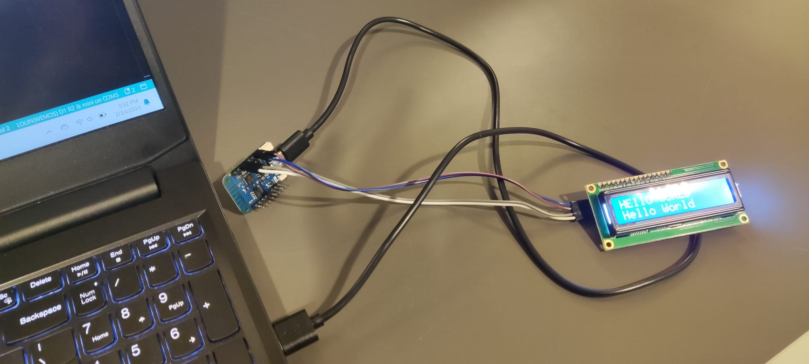

# Learning journal

## 2024-02-08
- Today I will continue working on my project. I will sketch out my design and ask for feedback, so I can improve my design. 
For now, I cannot continue working on my web-application because I have no idea where to start and what kind of setup I need.
Today I will try to find that out.

- I made two designs for my website and I didn't know which one to choose, so I asked for feedback and opinions. I ended up 
choosing the second design, because that one felt a little simpler for a 10-week project and I think the second design is 
easier to work with. I also think that I know how to start working on my website, because I saw some examples from other 
classmates.

## 2024-02-14
- Today I have worked on trying to make to turn on the LCD-screen and I also wanted to print something simple as "Hello
World" on it. The only thing I knew was that I needed to solder my backpack to my LCD-screen. So, that's the first thing
I did. I then looked up some tutorials and I had found a lot but a lot of them didn't really explain what I was supposed 
to do. I ended up being very confused because the things people were using in the video, were not in my kit. I ended up
asking for help, and then I looked up some pictures with my teacher and I ended up being able to turn the LCD-screen on
using my WeMos. Then, it was time to print "Hello World" on the LCD-screen. I picked my board and port in Arduino and 
something went wrong again. I kept getting this error: "A fatal esptool.py error occurred: Write timeout". I didn't know 
how to fix this at first, I switched from LCD-screen with a classmate, and it ended up working on her laptop. For some 
reason, three ports were available, COM5, COM6, and COM7. I was using COM7 at first, normally I use COM5, so I changed the
port to COM5, and it ended up working. This is how it ended up looking:

What I did was using female to female cables. I then connected each cable to its pin. SO for example, SCL would be connected
to D1. I did this for all four pins. Lastly, I ran the code in Arduino and was able to display the "Hello world". 
This is a website link that helped me:
[link for connecting WeMos to LCD](https://www.esp8266learning.com/wemos-mini-i2c-lcd-example.php)

## 2024-02-15
Today I learned how to use JavaScript again. The last time I used JavaScript was last year and even then everything was 
still a bit vague because JavaScript was very new to me and I didn't understand a lot. After struggling for a bit, I did 
manage to complete my work for the day. I managed to make the view of the website. On the website you can now see a form 
where you can enter the date, time and name of an appointment. I also added validation for the fields. This means if you
don't enter anything, a warning message will be displayed. That is all what I worked on for the web-application

## 2024-02-26
Today I have learned how to use the laser cutter. I had made the decision to work with wood and to do that I needed to 
use the laser cutter. Before this I made a simple sketch design in 2d and 3d with the programs inkscape and openscad. 
I then went to the makers lab to follow the workshop and to try something on my own. At first, I thought that laser cutting
would be very difficult, but it's actually very easy and pretty fun too. After the workshop was finished I decided that I 
want to start on my own design. Even though I only did the front of the pyramid, I wanted to at least have a first 
try/concept. This was a smart thing to do because now I know the measurements for my design. At first, I was unsure because 
I didn't want my design to look to big or too small. By using the laser cutter, I was able to figure how big/small I need 
some things to be. 
