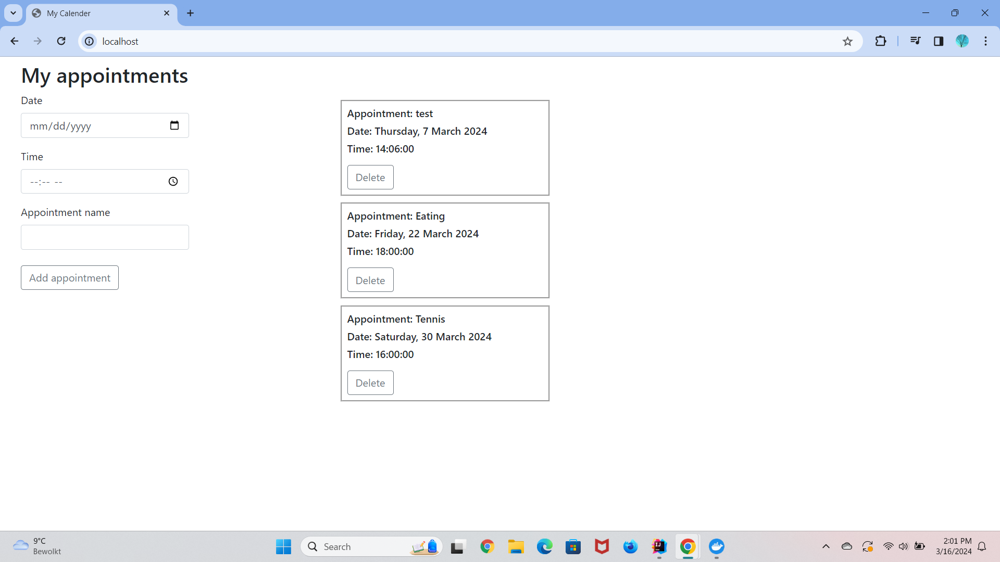

# Research 

## Research question

For the research market I will be researching about User Interaction. I want to find out how I can make it easier for 
non-it people to  use my website and device. My research question is:
- "What user interface elements can be added to optimize the user interaction for people with no IT-background?"

For this research question I have also added two sub questions:

- What are some common examples of user interface problems?

- What do people think of the user interface in my own website? 

## Introduction 

Do you struggle a lot to remember to attend all of your appointments while being busy with other things? You're not alone if you're one of the numerous busy 
people who experiences this issue on a daily basis. For this reason, I've created an easy-to-use website and digital 
calendar that are supposed to make appointment scheduling easier for individuals with busy schedules. 

Those that have a busy lifestyle and require a productive approach to schedule their appointments without having to deal with complicated 
technologies are part of my target group. My device is designed to make your daily routine more efficient. This device
is not something too small or too big, so you can place it anywhere you would like, for example your nightstand, on a 
desk or on a side table. 

This is how it works: On the website, you enter the date, time and name of the appointment, 
you save the appointment, and the appointment is now synced with the device. The appointment name will be seen on the 
device and approximately 30 minutes before the appointment, a buzzer will go off to remind you off the appointment. 
By clicking on the button you can turn the buzzer sound off. 

## Research Method 

For this research I have decided when I am going to <em>collect</em> the data, I will be collecting secondary data. I will do online research for my research 
question. This involves searching for different types of articles, reports and scientific articles that talk about common 
problems in user interaction.

I will be analyzing data in search for <em>qualitative data</em>. This
is because I want to improve my own project idea. I will be looking for common issues, recurring themes and ways to improve my device. 
I want to search and ask for the experiences of a couple of people on how difficult it is to use my own website
and what would help them to improve their user experience.

I will be conducting <em>descriptive research</em> and I hope I can get the answer to my research question by using these research 
methods. 
## Results 
_**What are some common examples of user interface problems?**_

When working with IT-related tools, there are several problems people face with the user interface. Common problems people
experience are: 

- Complex Navigation: Not knowing where to go or where to click next makes the user feel like they're lost. Lots of times 
when users get too frustrated with the complex navigation, they tend the abandon the website completely.

- Inconsistency in layout: When people see to many colours at once, different fonts or button styling, it disrupts the
user experience. It hinders the users by not having any focus while using the website or not being able to read everything 
clearly. 

- Slow pages: People always expect for a page to immediately load when they're interacting with the website. So, when a
page takes forever to load, they get frustrated and this will lead to increase in bounce rates. 

- Vague error messages: Validation is something that has to be added to a website if you want people to enter the right 
things for example. Though the error messages need to be clear, otherwise it could make the user feel helpless. When you 
display an error message that doesn't quite explain what the problem is, it will make it harder for the user to use the 
website.

- Disorganized content: Seeing to many things at once, makes the user feel like they don't know where to look or where 
to start. 

These are not the only problems people face when interacting with a website. More occurring problems are poor readability,
poor accessibility, complex forms and a lot more. 

(Beon Systems), (Nomensa)

_**What do people think of the user interface in my own website?**_

The last couple of weeks I have worked on my website and I have tried to make everything as simple as possible. I have 
added a form where you can enter the date, time and the name of the appointment. If you add the appointment a card like 
box will appear next to the form with a delete button if you want to delete the appointment. The design of the website 
looks like this:

I want to ask four people on their opinions on my website. I want ask for their opinion by asking three questions and
giving them 2 tasks.

1. What are your initial thoughts about the website design?
2. What do you think of the card design that has your appointment details?
3. Is it easy to understand what you need to do? 
4. Can you create an appointment to your choice? 
5. Can you delete one of the appointments?

#### First Person:
I let the first person try out my website. I first wanted to see if she would understand the purpose of the website, so 
I didn't explain anything yet, but she immediately realised that the website was for making appointments, though she did
understand it in a different way. I asked her the five questions and this is what came out of it.

1. She said that the website was easy to look at it, and it was very simple to use, so everybody could easily use it. It
wasn't like it was very difficult to find your way through the website. The website was handy according to her.

2. She liked the card design I used, because its simple, it tells you the date, time, and name of the appointment, and
it's also provided with a delete button if you want to delete your appointment. She also liked that a new one gets created
everytime you make an appointment, so each card has its own. 

3. She did understand initially that the website is used for appointments, but at first she thought that she had to enter
her own personal details. So, her date of birth and her name, but then I had to explain that it was for creating an appointment,
and then she realised it, and it made much more sense to her. 

4. Because everything was in English and that means the date and time format was also in English, she found it a little 
difficult. She didn't understand for example why the datepicker started with month instead of day, because usually when 
you make appointments here, you start with the day. She also didn't understand the time format, because normally the time 
is military time, but this time you had A.M. and P.M. and we don't use that here often, so she wasn't used to that. She did 
manage to create an appointment. 

5. I also asked here if she could delete an appointment, and she did. She clicked on the delete button and that wasn't 
hard at all.

I asked her if she had any other thoughts on my website, if she had something to add, and she said it was a nice website, 
but I could a little more colours to it. The website now only exists out of black and, grey and white mostly. One thing 
she also asked me if it was possible to change something after you created an appointment, so to update something, and I 
told her that that was not possible. 

## Second Person

1. The second user didn't really have an opinion about the website. The only thing he said was that the design looked
simple. 
2. He did like the design of the cards and thought that it was nice that you could see the necessary things only. 
3. When he looked at the website he didn't really understand what it was for. After I explained the website idea a little
he understood what it was for. 
4. He did create an appointment to his choice. He did struggle a little with entering the date. He kept entering the day 
for the month. 
5. He also could delete appointment to his choice. This wasn't a hard task for him. 

## Third Person
1. The third user really liked the way the website looked. She did mention that when you think of a calendar with
appointments, you mostly think of a roster. Because then you don't need multiple cards with the same date for example.
2. She liked the design of the cards. She said that they were small enough with all the needed information.
3. The moment she looked at the website, she knew what the website was for, because she took a good look at the cards and 
the form. 
4. When I asked her if she could create an appointment, she immediately did it. She didn't have a problem with the format 
of the date or time. 
5. When I asked her to delete one of the appointments, she chose one, and clicked on the delete button. She didn't have 
to ask if it is the right button or not. 

## Conclusion 
## Recommendations
## Sources
1. A, S. (2024, 22 februari). UI Design: 15 Things That Tell You It Is a Problem. Beon Systems. https://beonsystems.com/ui-design-15-things-that-tell-you-it-is-a-problem/ 
2. Nomensa. (2023, 14 november). 10 common usability problems with websites. Nomensa. https://www.nomensa.com/blog/10-common-usability-problems-with-websites/
