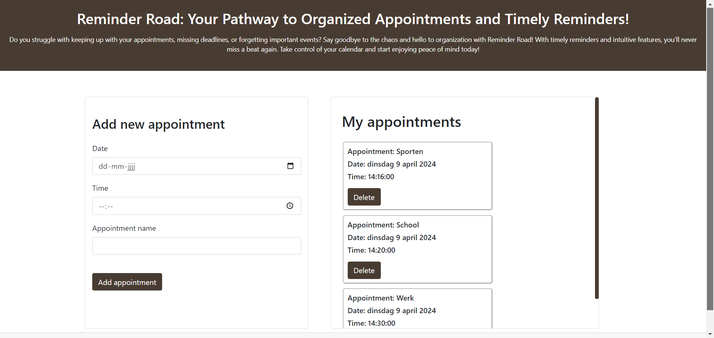

# Research 

## Research question

For the research market I will be researching about User Interaction. I want to find out how I can make it easier for 
non-it people to  use my website and device. My research question is:

- "What user interface elements can be added to optimize the user interaction for people with no IT-background?"

For this research question I have also added two sub questions:

- What are some common examples of user interface problems?

- What do people think of the user interface in my own website? 

## Introduction 

Do you struggle a lot to remember to attend all of your appointments while being busy with other things? You're not alone if you're one of the numerous busy 
people who experiences this issue on a daily basis. For this reason, I've created an easy-to-use website and digital 
calendar that are supposed to make appointment scheduling easier for individuals with busy schedules. 

Those that have a busy lifestyle and require a productive approach to schedule their appointments without having to deal with complicated 
technologies are part of my target group. My device is designed to make your daily routine more efficient. This device
is not something too small or too big, so you can place it anywhere you would like, for example your nightstand, on a 
desk or on a side table. 

This is how it works: On the website, you enter the date, time and name of the appointment, 
you save the appointment, and the appointment is now synced with the device. The appointment name will be seen on the 
device and approximately 30 minutes before the appointment, a buzzer will go off to remind you off the appointment. 
By clicking on the button you can turn the buzzer sound off. 

## Research Method 

For this research I have decided when I am going to <em>collect</em> the data, I will be collecting secondary data. I will do online research for my research 
question. This involves searching for different types of articles, reports and scientific articles that talk about common 
problems in user interaction.

I will be analyzing data in search for <em>qualitative data</em>. This
is because I want to improve my own project idea. I will be looking for common issues, recurring themes and ways to improve my device. 
I want to search and ask for the experiences of a couple of people on how difficult it is to use my own website
and what would help them to improve their user experience.

I will be conducting <em>descriptive research</em> and I hope I can get the answer to my research question by using these research 
methods. 
## Results 
_**What are some common examples of user interface problems?**_

When working with IT-related tools, there are several problems people face with the user interface. Common problems people
experience are: 

- Complex Navigation: Not knowing where to go or where to click next makes the user feel like they're lost. Lots of times 
when users get too frustrated with the complex navigation, they tend the abandon the website completely.

- Inconsistency in layout: When people see to many colours at once, different fonts or button styling, it disrupts the
user experience. It hinders the users by not having any focus while using the website or not being able to read everything 
clearly. 

- Slow pages: People always expect for a page to immediately load when they're interacting with the website. So, when a
page takes forever to load, they get frustrated and this will lead to increase in bounce rates. 

- Vague error messages: Validation is something that has to be added to a website if you want people to enter the right 
things for example. Though the error messages need to be clear, otherwise it could make the user feel helpless. When you 
display an error message that doesn't quite explain what the problem is, it will make it harder for the user to use the 
website.

- Disorganized content: Seeing to many things at once, makes the user feel like they don't know where to look or where 
to start. 

These are not the only problems people face when interacting with a website. More occurring problems are poor readability,
poor accessibility, complex forms and a lot more. 

(Beon Systems), (Nomensa)

_**What do people think of the user interface in my own website?**_

The last couple of weeks I have worked on my website and I have tried to make everything as simple as possible. I have 
added a form where you can enter the date, time and the name of the appointment. If you add the appointment a card like 
box will appear next to the form with a delete button if you want to delete the appointment. The design of the website 
looks like this:

I want to ask four people on their opinions on my website. I want ask for their opinion by asking three questions and
giving them 2 tasks.

1. What are your initial thoughts about the website design?
2. What do you think of the card design that has your appointment details?
3. Is it easy to understand what you need to do? 
4. Can you create an appointment to your choice? 
5. Can you delete one of the appointments?

_**Question 1: Initial Thoughts about Website Design**_

- 4/4 of the users found the website design to be simple and easy to navigate.
- 3/4 of the users suggested adding more colors to enhance the visual appeal of the website.

_**Question 2: Opinion on Card Design for Appointments**_

- 4/4 generally liked the simplicity of the card design and found it informative.
- 1/4 of the users suggested considering a different layout to avoid redundancy when multiple appointments fall on the same date.

_**Question 3: Ease of Understanding and Navigation**_

- 3/4 of the users understood the purpose of the website
- 1/4 of the user didn't understand the purpose, however once explained, the user found it easy to comprehend and 
navigate through the website.

_**Task 1: Creating an Appointment**_

- Users were able to create appointments without significant difficulty.
- 3/4 encountered minor issues with date and time format, they kept entering the dat number for the month and the month 
number for the day, and didn't quite understand the AM/PM or forgot to enter it, but overall managed to proceed with 
the task successfully.

_**Task 2: Deleting an Appointment**_

- Deleting appointments was straightforward for all users, with no notable challenges reported.

#### Analysis and Insights

In general, users valued the website design's functionality and simplicity. 
There were, however, some recommendations for enhancements, such incorporating additional colors and thinking about 
other arrangements for showing several appointments on the same day. Users completed tasks without significant difficulty, 
despite minor errors with date and time formats.

After the research I have done I concluded that these are the problems I need to fix in my website:

1. Changing the layout
2. Fixing the date and time format

#### Commentary

1/4 of the users didn't understand the format of the date in the cards. The user asked why the format of the date is in 
Dutch while the website is in English. He wondered why the format didn't look like this (for example): April 8th 2024.

1/4 of the users asked if it was possible to edit the appointment, because if you make a mistake do you have to create 
the appointment again. 

## Conclusion

- "What user interface elements can be added to optimize the user interaction for people with no IT-background?"

To answer my own research question, I conducted a research by looking for common examples of bad user interface
that people experience when using a website and I asked for user opinions of my website to improve the user interface.

#### Conclusion: Addressing the Research Question
The results of the research provide insight into the essential UI components that are needed to maximize engagement for
non-IT professionals. Through a comprehensive examination of prevalent user interface issues and the integration of user 
testing feedback, we are able to identify practical suggestions for enhancing the user experience.

_**Typical Issues with User Interfaces**_

Users encounter difficulties while dealing with IT-related tools, as demonstrated by an analysis of frequent user 
interface issues. Problems with unclear error messages, erratic layout, complicated navigation, sluggish website loads, 
and disjointed information were noted as obstacles to a seamless user experience.

_**Results from User Input**_

User-provided direct feedback offered insightful viewpoints on the advantages and disadvantages of the user interface 
on my website. Although most users said the design was straightforward and easy to use, there were certain areas that 
needed work. These include adding color to improve visual appeal, changing the layout of the website, and lastly fixing 
the format of the date and time.

By tackling common user interface problems and including user feedback, I can improve my own website that I have 
created. Implementing recommendations such as simplifying navigation, enhancing visual consistency, optimizing page 
loading times, refining error messaging, and considering user preferences can remarkably improve the overall user 
experience for this demographic.

## Recommendations

These are the recommendations I have gotten from the research results:

1. Enhance visual consistency: Simplify the design and layout to produce an interface that is both aesthetically 
pleasing and consistent.

2. Optimize Page Loading Times: To reduce user wait times and avoid annoyance, optimize the performance and loading 
speed of your website.

3. Refine Error Messaging: Give users clear, helpful error messages to help them figure out how to fix problems on 
their own.

4. Organize Content Effectively: Organize information logically and hierarchically to make it easier to navigate and 
understand.

5. Tackle Date & Time Format: To ensure clarity and consistency, standardize the date and time format to meet user 
expectations and preferences.

# Implementation

I will explain now how I implemented all the results from my research in my website. Below you can also find a picture of
how the website looks like now.

### Fixing the date and time format

During the interview I was taking with the users, I noticed that they had some problems with entering the date and time.
So I knew that I had to fix that. At first, I tried to make changes in HTML. I tried to add a placeholder, a value, a 
title( so that when you hover over it, it will tell you to add the date in the right format), a format and none of it worked.
Then I tried changing the format in javascript and that didn't work too. 
Later I found out that that my Google Chrome language is set in English and that's why the date format was mm/dd/yyyy. 
I changed the language to Dutch and that fixed not only the date format, but also the time format immediately.

### Fixing the layout

During the interview I was taking with the users, the users told me that the website looked very empty and dull. So, I 
ended up changing the layout. 

_**Changes in HTML**_

I noticed that the users had to look closely to the form, because it was kind of hidden in the left top corner. So I 
put the form in the middle of the website by changing the styling a little in HTML. I added a title to the form and made 
the input fields a little longer. 

Next, I fixed the appointment cards. I put all the appointments in a card and I added a title to it. I also noticed that 
if you added more and more appointments, the page kept getting longer, so I added a scrollbar to the appointments, so 
the users can easily see all the appointments without the page being so long.

Lastly, I added a header in the colour taupe, so the website would have more colour but also have a professional look to 
it. In the header I added a fun title and explanation for the website that I generated.

_**Changes in JavaScript**_

I sorted the appointments on date and time, so all the appointments would be set in chronological order. This makes it 
easier to find an appointment for the user. 

Everytime a user adds a new appointment a message will appear that the appointment is added successfully. At first, you 
had to refresh the page yourself to remove the message and clear the input fields, but I have added a cross button next 
to the message, and if you click on that, the message disappears and the input fields are cleared. This is done because 
it's easier for users to create a new appointment if everything is empty and the message is gone. 

I also added a message for when the user deletes an appointment, that way the user knows for sure that it has been deleted.

## Sources
1. A, S. (2024, 22 februari). UI Design: 15 Things That Tell You It Is a Problem. Beon Systems. https://beonsystems.com/ui-design-15-things-that-tell-you-it-is-a-problem/ 
2. Nomensa. (2023, 14 november). 10 common usability problems with websites. Nomensa. https://www.nomensa.com/blog/10-common-usability-problems-with-websites/
