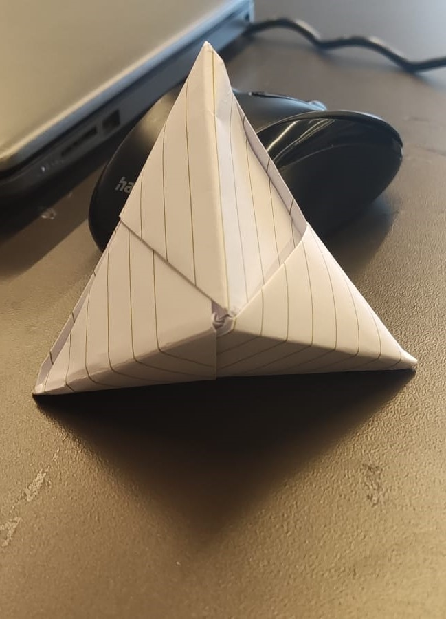
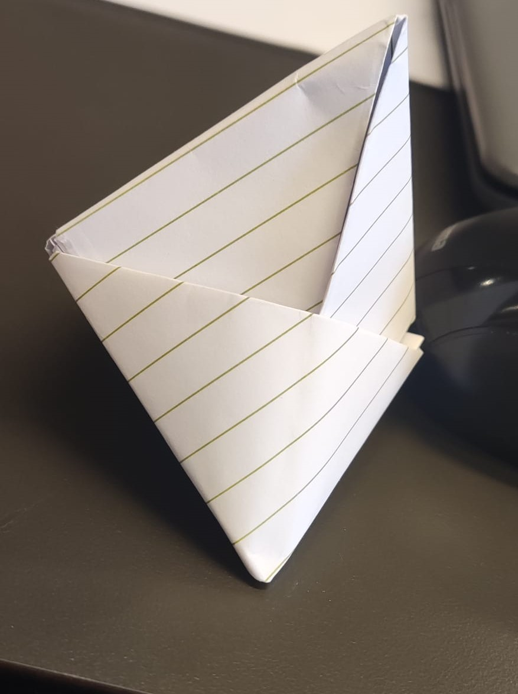

# Concept & Design

### User needs
This device is for someone who has a lot of appointments and keeps forgetting them. Someone who always forgets their 
appointments is in need of reminders. For the ease of the user you can use a simple device for this. When you make an 
appointment, you will receive a reminder for it. You will get notified by a sound. The smart 
device will also have a button, so you can turn the sound off. You can also see the name and time of your appointment 
displayed on the smart device. The device will be made in a way that you can place it anywhere you want; your desk, your
bedroom, living room for example?

### Main goal
So in short, the main goal of this device is to make it easier for a user to follow their appointments without having
the need to keep checking on which day the appointment is and what time the appointment takes place.

### Requirements
To meet the user needs, these are the requirements I have set up for the smart device:
- As a user I want the device to make use of an LCD-display screen, so I can see the name of my appointment. By using 
the LCD-display the appointment name can be display on the device for the user. This is easy because you can immediately 
read what your appointment is. 
- As a user I want the device to contain an active buzzer. This buzzer will go off at least one hour before the 
appointment so the user will have enough notice to prepare for the appointment. 
- As a user I have access to a website to make all of my appointments. A simple website will be provided so the user 
can enter the date, time and appointment name. 
- As a user I can expect a push button to turn the buzzer off. With this push button the user can turn the buzzer off. 
This is because it wouldn't be nice for the user to have a sound keep going off for one hour for example. 
- As a user I can expect to see the next appointment after I turned the buzzer for the previous appointment off. 
One requirement I want to try to make work is that the moment the user turns off the buzzer, the next appointment will 
be displayed on the LCD-display screen. 
- As a user I can expect that the device makes use of an LDR. The moment that the device detects darkness, the color 
of the screen will be changed. I think this is nice for the user because if it's night it doesn't bother the user with 
a bright color. 

### Design
I have chosen to design a pyramid as the smart device. I think a pyramid is simple, easy to look at and doesn't require
lots of functionalities to actually understand the device. The pyramid will have 4 sides and will look like a 3d pyramid. 
This is because I can place different technical materials on different sides. The LCD-display screen will be placed on 
the front of the pyramid. The push button to turn the buzzer off, will be placed on the right side of the pyramid. Below
I have some starter designs for the pyramid I want to build:

Here I have made an origami pyramid. It doesn't look very nice because I made it from paper. But it does resemble the 
design I want to have for my smart device.

