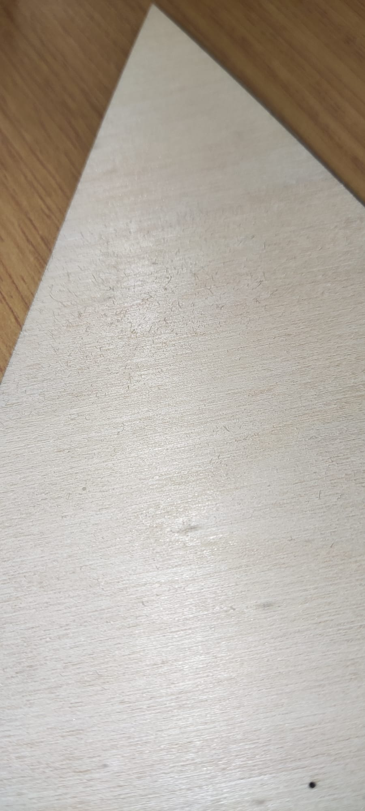
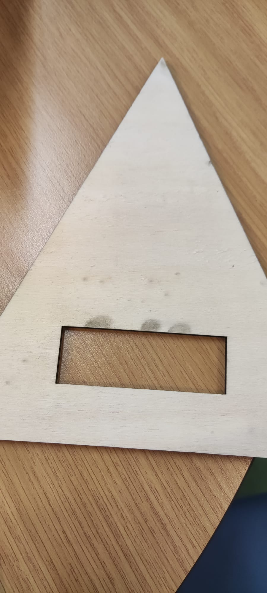

# Concept & Design

## Concept

### User needs
This device is designed to assist individuals who struggle to remember their appointments due to their busy schedules. 
It serves as a reliable reminder system tailored to their needs. The device operates simply: upon scheduling an appointment, 
it automatically sets up reminders to ensure the user doesn't forget. These reminders are delivered audibly through a 
notification sound.

In addition to auditory alerts, the device features a practical button that allows users to easily mute or silence the 
reminders, providing flexibility and control over their notification preferences. Furthermore, crucial details such as 
the name and time of each appointment are displayed on the device's screen, enhancing visibility and accessibility.

One of the key advantages of this device is its versatility in placement. Whether it's on a desk, bedside table, or in
the living room, users can position it wherever it's most convenient for them, ensuring that they never miss an
appointment again.

### Main goal
So in short, the main goal of this device is to make it easier for a user to follow their appointments without having
the need to keep checking on which day the appointment is and what time the appointment takes place.

### Requirements
To meet the user needs, these are the requirements I have set up for the smart device:
- As a user I have access to a website to make all of my appointments. A simple website will be provided so the user 
can enter the date, time and appointment name.

- As a user I want the device to make use of an LCD-display screen, so I can see the name of my appointment. By using 
the LCD-display the appointment name can be display on the device for the user. This is easy because you can immediately 
read what your appointment is. 

- As a user I want the device to contain an active buzzer. This buzzer will go off at least one hour before the 
appointment so the user will have enough notice to prepare for the appointment.

- As a user I can expect a push button to turn the buzzer off. With this push button the user can turn the buzzer off. 
This is because it wouldn't be nice for the user to have a sound keep going off for one hour for example. 

- As a user I can expect that the device makes use of an LDR. The moment that the device detects darkness, the color
  of the screen will be changed. I think this is nice for the user because if it's night it doesn't bother the user with
  a bright color.

- As a user I can expect to see the next appointment after I turned the buzzer for the previous appointment off. 
One requirement I want to try to make work is that the moment the user turns off the buzzer, the next appointment will 
be displayed on the LCD-display screen.

### Design
I have chosen to design a pyramid as the smart device. I think a pyramid is simple, easy to look at and doesn't require
lots of functionalities to actually understand the device. The pyramid will have 4 sides and will look like a 3d pyramid. 
This is because I can place different technical materials on different sides. The LCD-display screen will be placed on 
the front of the pyramid. The push button to turn the buzzer off, will be placed on the right side of the pyramid. Below
I have some starter designs for the pyramid I want to build:

Here I have made an origami pyramid. It doesn't look very nice because I made it from paper. But it does resemble the 
design I want to have for my smart device.

### Measurements
*Latest measurements:* 

Pyramid side: 17 cm. 
LCD-screen: 7.2 x 2.4 cm.

## Digital Manufacturing

### First prototype

For the first prototype I used the speed/power 20.0/65.0. I used the material MDF with a measurement of 4mm
and everything went well. Though I did find out one week after that I entered the wrong material in de software program.
I entered wood (as I was told to enter)but I was actually using MDF. Even though I did enter the wrong material, 
the design came out good. There were no burn marks or whatsoever. The only thing that wasn't accurate was the measurements
for my design.

### Second prototype
For the second prototype I used another material. This time I used plywood with a thickness of 4mm and with the same 
speed/power 20.0/65.0. This time things didn't go all too well, because after the laser was done with cutting, 
I saw some black spots on the back of my design. I think the power was too high for the plywood. I also didn't like how 
the plywood felt and looked. So I have decided to definitely use the MDF material for my design. Something I also realised
is the new measurements I used, weren't the right measurements either.

## Digital Design

### Software choice
The software I have chosen for my design is Inkscape. The reason why I have chosen Inkscape is that I have a pyramid as 
my design. I find more joy in making designs in software programs like inkscape instead of openScad. 
Even though the pyramid is a 3d object, I think it's better to use Inkscape. Mainly because of the type of material 
I want to use. I want to use the wood MDF material, because I think given my design, it's easier to work with pyramid. 
Wood gives me option to easily put the all the 4 sides together on the contrary with using polystyrene. The device I am 
using to make my design is the laser cutter. Using the laser cutter is more efficient because it's fast and very precise.
This is also a reason why I choose to not work with the 3d-printer. If I make a mistake during the laser cutting I can 
easily fix it and cut out a new design, but with the 3d-printer it takes a while before I have the new design. 

### Design process

In this picture you can see the 2d design I have created in Inkscape. For the first prototype, I just made a triangle 
with a rectangle inside it. In the picture you can see that the pyramid is pretty small. When I first laser cut this, it 
came out pretty small. So, I knew that it needed to look bigger. 

In this picture you can see that the pyramid looks bigger. The pyramid now looks bigger and during the laser cutting this 
did look much better. 
### Documentation 

