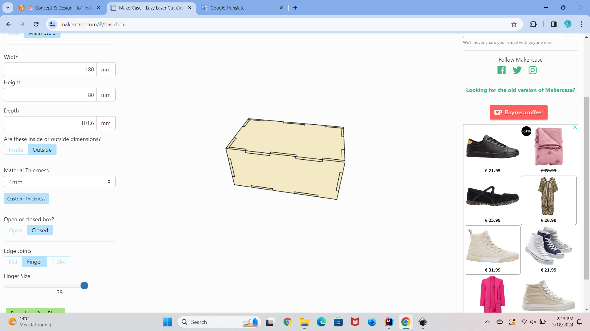

# Concept & Design

## Concept

### User needs
This device is designed to assist individuals who struggle to remember their appointments due to their busy schedules. 
It serves as a reliable reminder system tailored to their needs. The device operates simply: upon scheduling an appointment, 
it automatically sets up reminders to ensure the user doesn't forget. These reminders are delivered audibly through a 
notification sound.

In addition to auditory alerts, the device features a practical button that allows users to easily mute or silence the 
reminders, providing flexibility and control over their notification preferences. Furthermore, crucial details such as 
the name and time of each appointment are displayed on the device's screen, enhancing visibility and accessibility.

One of the key advantages of this device is its versatility in placement. Whether it's on a desk, bedside table, or in
the living room, users can position it wherever it's most convenient for them, ensuring that they never miss an
appointment again.

- As a user I can expect to see the appointments on the LCD-screen, so I know which appointments I have on today's day
- As a user I want a buzzer to go off, so I can be reminded for an appointment.
- As a user I want to have a button, so I can turn the buzzer off when it's time for an appointment
- As a user I can see the LED turn on when it's dark.

### Main goal
So in short, the main goal of this device is to make it easier for a user to follow their appointments without having
the need to keep checking on which day the appointment is and what time the appointment takes place.

### Requirements
To meet the user needs, these are the requirements I have set up for the smart device:

- The device makes use of an LCD-display screen, so you can see the name of my appointment. By using 
the LCD-display the appointment name can be display on the device for the user. This is easy because you can immediately 
read what your appointment is. 

- The device to contains an active buzzer. This buzzer will go off at least one hour before the 
appointment so the user will have enough notice to prepare for the appointment.

- A push button will be used to turn the buzzer off. With this push button the user can turn the buzzer off. 
This is because it wouldn't be nice for the user to have a sound keep going off for a while. 

- The device makes use of an LDR and a LED. The moment that the device detects darkness, the color
  of the LED will be changed. 

### Design
I have chosen to design a box as the smart device. I think a box is simple, easy to look at and doesn't require
lots of functionalities to actually understand the device. The box will have 4 sides and will look like a 3d box. 
This is because I can place different technical materials on different sides. The LCD-display screen will be placed on 
the front of the box. The push button to turn the buzzer off and the LED, will be placed on top of the box. 

### Measurements
*Latest measurements:* 

Box side: 18 cm. 
LCD-screen: 7.2 x 2.4 cm.

## Digital Manufacturing
The material I am using for my embedded device is MDF. The reason why I am using MDF is because of my design. I am designing
a box, and I want the box to be pretty strong. The material is pretty hard and pretty strong, so that is perfect for my design.
If I need to cut something out the material it would also work pretty well, and it would not melt for example. 
I am also using the laser cutter instead of the 3d-printer, because 3d-printing would take longer and the laser cutter 
gives me option to make multiple designs in a small amount of time. 

## Digital Design

### Software choice
The software I have chosen for my design is Inkscape. The reason why I have chosen Inkscape is that I have a box as 
my design. I find more joy in making designs in software programs like inkscape instead of openScad. 
Even though the box is a 3d object, I think it's better to use Inkscape. Mainly because of the type of material 
I want to use. I want to use the wood MDF material, because I think given my design, it's easier to work with box. 
Wood gives me option to easily put the all the 4 sides together on the contrary with using polystyrene. The device I am 
using to make my design is the laser cutter. Using the laser cutter is more efficient because it's fast and very precise.
This is also a reason why I choose to not work with the 3d-printer. If I make a mistake during the laser cutting I can 
easily fix it and cut out a new design, but with the 3d-printer it takes a while before I have the new design. 

### Design process

#### Monday 26-02-2024
On this day I went to makers-lab to follow the workshop. The workshop was easy to understand and after the workshop I 
wanted to try to laser cut something on my own. I did ask for some help because some things were a little too confusing,
but I managed to make a first-design concept for my project. I also worked on the measurements I needed for my design

#### Monday 4-03-2024
On this day I went to the makers-lab again to cut a new design with some new measurements. This time I used another material
than last time. Last time I used MDF and this time I went for plywood. I think the plywood material was not so nice to work
with because it was very rough. The new measurements I had for my design were partially not right, the length for the pyramid
was ok but the time measurements for the LCD-screen were too big. I measured everything again and I plan on making a new 
design next week with the right measurements. 

#### Monday 11-03-2024
On this day I went to the makers-lab again to cut out a design that has fingers. Today I worked with the multiplex material
and this time it wasn't so bad like the last time. I thought I had a good design, but it ended up not looking too good.
I tried to give the fingers in my design different measurements and nothing worked, it kept coming out the wrong way. 
I tried to make another design in the makers case and I think I am going to use that one next week. 

#### Monday 18-03-2024
On this day I asked for advice from the teacher because I didn't know how to properly use the finger joints. My design idea
also started to change a little, because I had to make a design in makers-case and the pyramid ended up looking a little 
different. I went to the makers-lab and tried to use the makers-case with a box design this time. At first, it didn't work 
again, but then I just asked for help from someone who works there, and he explained everything perfectly. I created a 
design in makers-case and with the right measurements of everything this time, I laser-cut it and I tried to fit each side
into the other, and it fits perfectly. Next I am going to make cuts for the LCD-screen, button and led. 

#### Monday 25-03-2024
On this day I went to the makers-lab. I wanted to finish up my design. The only thing that was left to do was cut out some 
shapes for the LCD-screen, push button, LED and LDR. I had two versions of my design, so I practiced on the first one and 
cut out some shapes with different measurements. I ended up finding the right measurements and I cut them out. I think I 
finished working on the design in the makers-lab. 

### Documentation 

### First prototype

For the first prototype I used the program LIGHTBURN to create a triangle to cut out. This was the first time I tried using
the laser cutter, so I didn't have any software program to create my design in. I made a simple triangle with a rectangle 
inside it. This is an example: 

### Second prototype
For the second prototype I used the software program Inkscape. Here I made 4 triangles for the pyramid I wanted with a 
rectangle on the front for the LCD-screen. I also added a circle on the side of the pyramid for the push button I want 
to add in the design. For this design I did have some measurements and that was 170 mm for the triangle. My plan is to
glue them together. 

### Third prototype
Since we're not "allowed" to use any glue or tape, I wanted to work with fingers in my design. I searched on Google for some
websites and I found one that kind of gave me pyramid design with the finger cuts. I added some measurements and I think 
it looks pretty good now to cut out. Since the website does not have an actual design for a pyramid. I had to use the shape
of an octahedron, but I want to cut out this first and see if I can add something on the bottom. 

### Fourth prototype
For the fourth prototype I have changed my design idea. Since the pyramid didn't work with the finger joints and this 
design idea in the makers-case wasn't practical. Building it like this didn't make any sense to me, and it didn't look nice
at all:

So I just chose to build a box as my design. I think working with a box will be easier for my project idea. In the makers-case
I added some measurements for the height and width. I added the material thickness of 4mm, because I want to use MDF. Lastly,
I added 39 as the size of the finger joints. I downloaded de box-plans and added some line thickness in Inkscape.
Below is a picture of the design in makers-case and in Inkscape: 

