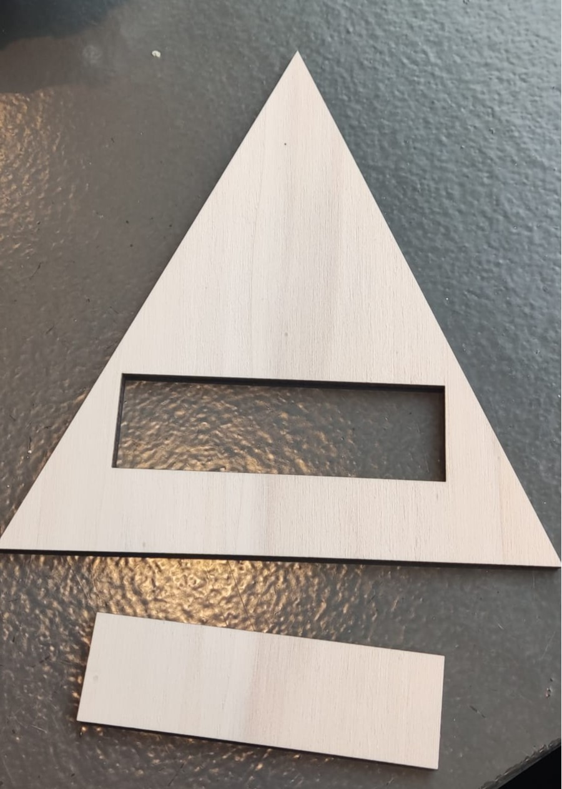
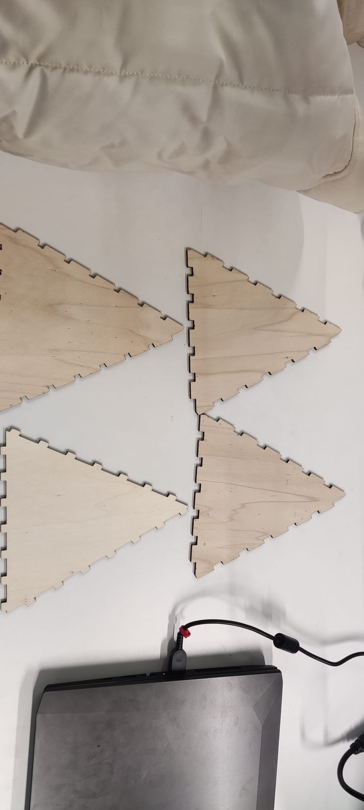
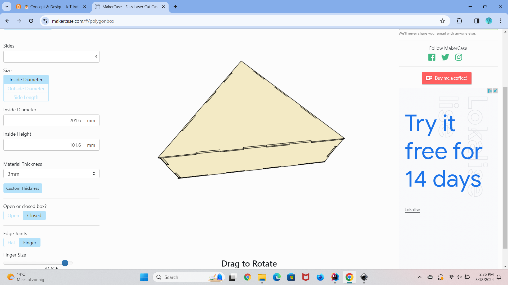

# Conclude & Reflect

## Usability of Product

Below you'll find a video of the final working product. In the video I show that the LED works when it's dark (I cover 
the LDR with my hand), I show you how I create an appointment, I show that I am waiting for the buzzer to go off and 
that I can turn te buzzer off. P.S. Sorry for any background noice and my voice :)

Link: [Final product design](https://youtu.be/wGgFLyGELOs)

## Achieved requirements

All the requirements I set for the device are met. Below you'll find a reflection combined with a recommendation

**Requirement 1: LCD-screen displays appointments**

- Assessment: During the testing, the device successfully displayed the appointments on the screen. All the users verified
that they could see the appointment on the screen.
- Recommendation: It would be nice if it wouldn't take a while for the appointment to show on the LCD-screen, because
 otherwise other users will think that the appointment was never added.

**Requirement 2: Buzzer for appointment reminder** 

- Assessment: During the testing, the device successfully let the buzzer go off one hour before the appointment. The users
could also identify the sound.
- Recommendation: It would be nice to create a nice tune for the buzzer. Now it sounds like a long peep which is quite 
loud to hear.

**Requirement 3: Button to turn buzzer off**

- Assessment: During the testing, the users could turn off the buzzer by clicking on the button. One of the users wasn't
too quick with it, but they did manage to do it. 
- Recommendation: The placement of the button doesn't look nice. It would be better to place it somewhere else where  
it really stands out.

**Requirement 4: LED turns on when it's dark**

- Assessment: This was not one of the most important requirements that had to be tested, but I did let the users test it
out really quick. 
- Recommendation: After explaining what the LDR and LED do, the users told me that I should change the placement of them.

## Four failures

**1. No way of connecting the sides**

For my first design I wanted to make a pyramid with the laser cutter. I wanted the pyramid to look like a 3d pyramid. 
After I cut out two sides of the pyramid, I realised I didn't know how to connect all the sides with each other. Then I 
thought I could just use glue, but that wasn't really allowed because my design would count as a not perfect design because I 
used glue. 

To fix this, I could've either changed the device I was using to a 3d-printer or I could use finger joints on my design. 
Using the finger joints for a pyramid wasn't a very well option. I think I would've been done faster if I used the 
3d-printer. 

**2. Failure with finger joints**

I thought I could use finger joints on the sides of the pyramid, because then it would easily connect with each other
without using glue. I found a website that sort of gave me a design I could cut with finger joints. This went completely 
wrong, because the website gave me a design with the pyramid sides looking all the same, so the sides didn't match at all.
I tried to change the measurements on the website but nothing worked and I ended up with still no usable design product.

To fix this, I could've made my pyramid design on another website, the makers-case for example, but I could've still 
used the 3d-printer. Though I really did want to use the laser-cutter. I ended up choosing to make my design in the 
makers-case, resulting in another failure.

**3. Making a pyramid in the makers-case**

In the makers-case I created a pyramid design that ended up looking like this. I thought this was a great idea because 
now I could use the finger joints in the right way. But the more I kept looking at the design, it started to look very
weird. I tried changing the measurements, but it just didn't look nice at all.

I ended up not being satisfied at all. To fix this problem I changed my design completely. I decided to just create 
a box, because using a box would easily fix all my problems. I could use the finger joints nicely, and it's a simple 
design.

**4. Box was too small at first**

I created a box in the makers-case and I thought I finally had the right design. I went to cut it out, and it turned 
out so small, and the box kept falling apart, I didn't know what went wrong at first. To solve this problem I asked a
teacher for help in the makers-lab and I then realised that I kept changing the width and height in the LIGHTBURN program
and that's why it ended up looking so small. I also used the wrong the notch and that's also why the box kept falling apart.

To fix this, I could not change anything in the LIGHTBURN and just leave it the way it's imported, and I could make the 
notch smaller. I did exactly that.

