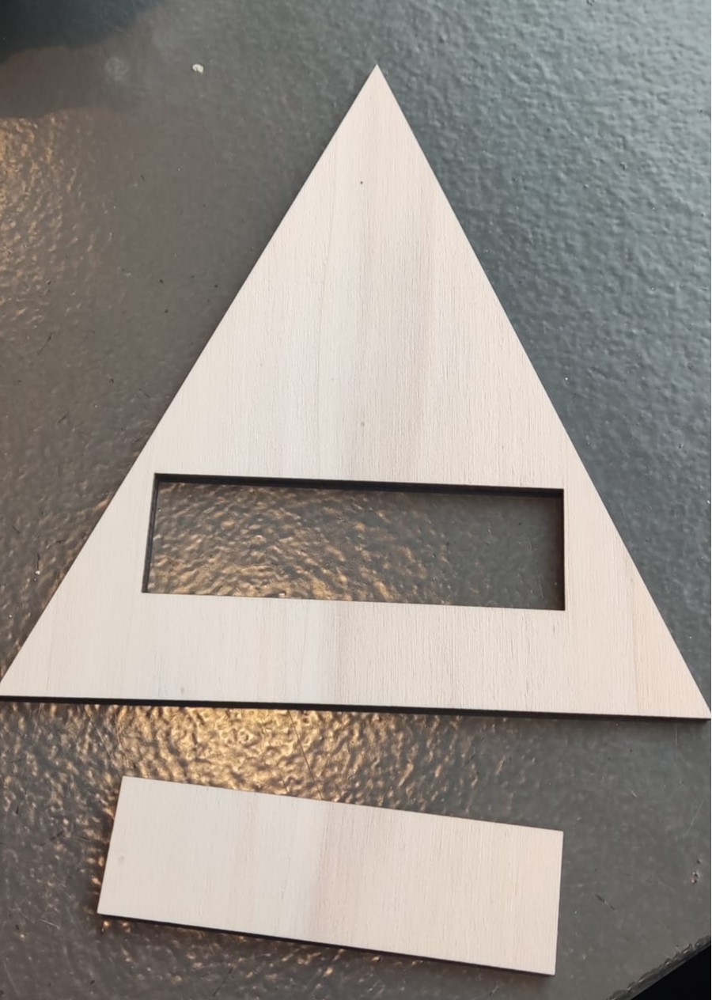
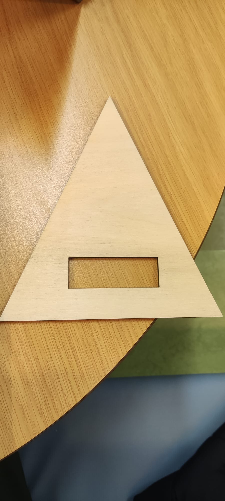
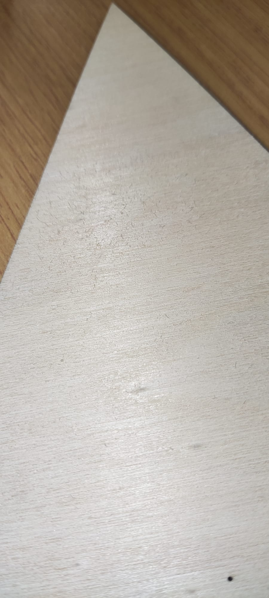
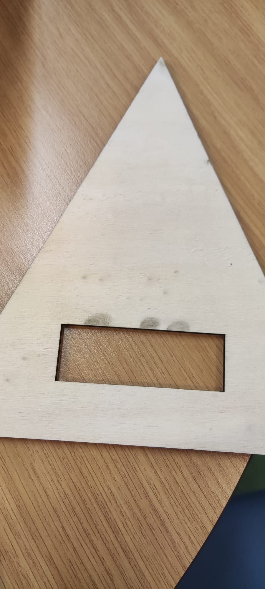
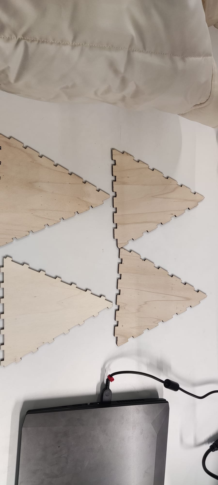
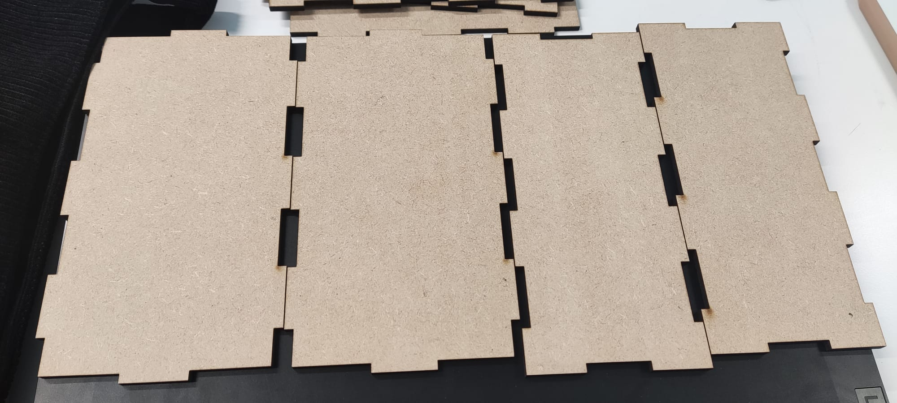
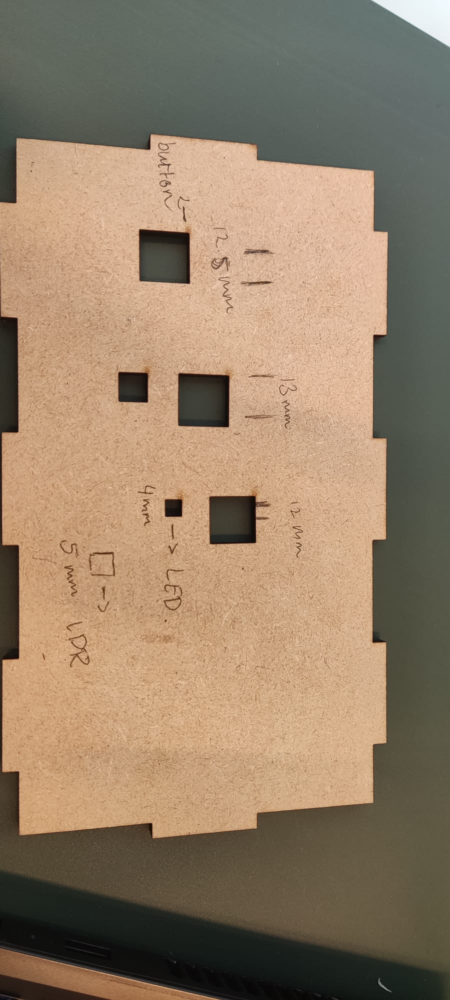
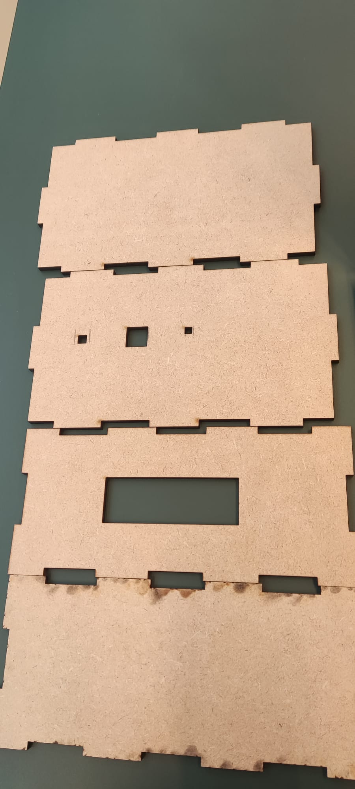

# Create & Test

## Digital Manufacturing

### Device and Material
The device I have used to create my design is the laser cutter. The reason why I chose to use the laser cutter is because
I wanted to work with wood. I used the laser cutter in the makers-lab. The type of wood I have chosen to work with is 
4mm MDF. I first made a design on the makers-case website and the measurements I used in there are:

- Width: 180 mm
- Height: 80 mm
- Depth: 101.6 mm
- Finger size: 39
- Notch: 0.18 mm
- LCD-screen: 71 mm * 24 mm 
- Push button: 12.1 mm * 12.1 mm
- LED: 4 mm * 4 mm
- LDR: 4.75 mm * 4.75 mm
- Opening for USB c cable: 12.0 * 6.5 mm

### Manufacturing settings
These are manufacturing settings that I used while working with the laser cutter in the makers-lab:

- Material: MDF wood
- Material thickness: 4mm
- Speed: 16.0
- Power: 75.0
- Focus: ON

## Optimization

| Prototype | Material Used | Speed/Power | Outcome                                                    | Optimization                                         |
|-----------|---------------|-------------|------------------------------------------------------------|------------------------------------------------------|
| 1         | MDF           | 20.0/65.0   | Accurate design but wrong material entered initially.      | -                                                    |
| 2         | Plywood       | 20.0/65.0   | Black spots due to high power. Decision to stick with MDF. | Change the material back to MDF.                     |
| 3         | Multiplex     | 20.0/65.0   | Issues with finger joints.                                 | Experiment with different finger joint measurements. |
| 4         | MDF           | 16.0/75.0   | Shifted to building a box. Initial size issues fixed.      | Import design without alterations.                   |
| 5         | MDF           | 16.0/75.0   | Cutting shapes for components. Finalizing design.          | -                                                    |

### Different prototypes

#### First prototype

For the first prototype I used the speed/power 20.0/65.0. I used the material MDF with a measurement of 4mm
and everything went well. Though I did find out one week after that I entered the wrong material in de software program.
I entered wood (as I was told to enter)but I was actually using MDF. Even though I did enter the wrong material,
the design came out good. There were no burn marks or whatsoever. The only thing that wasn't accurate was the measurements
for my design.

#### Second prototype
For the second prototype I used another material. This time I used plywood with a thickness of 4mm and with the same
speed/power 20.0/65.0. This time things didn't go all too well, because after the laser was done with cutting,
I saw some black spots on the back of my design. I think the power was too high for the plywood. I also didn't like how
the plywood felt and looked. So I have decided to definitely use the MDF material for my design. Something I also realised
is the new measurements I used, weren't the right measurements either.

#### Third prototype
Since we're not "allowed" to use any glue or tape, I wanted to work with fingers in my design. I used multiplex again,
because that's the only test material there was and this time it did look good. I searched on Google for some
websites and I found one where I can laser cut a pyramid with. It didn't go too well. I cut out the first design, only
two sides of the pyramid, with the fingers and when the cutting was done, I saw that the fingers were the exact same. I then
tried some other measurements for the fingers, but it didn't fit again. I ended up with four different sides and none of them
fit with the other. I tried to make a new design in makers case and next time I am going to try to cut that design out.

#### Fourth prototype
For the fourth prototype I have changed my design idea. Since the pyramid didn't work with the finger joints and this
design idea in the makers-case wasn't practical. Building it like this didn't make any sense to me, and it didn't look nice
at all:

So I just chose to build a box as my design. I bought some MDF material and I cut out my design three times. The first one
was too small because I changed the measurements in the LIGHTBURN program, but that was my fault. The second and third
came out perfectly, this time I just imported it and didn't change anything. The sides fit perfectly with each other. I 
cut out the design twice, because on one I want to cut out some shapes to check which measurements I need for the device 
materials. Unfortunately, I didn't take a picture of the box before I took the box apart. 
Below is a picture of the design I cut:

#### Fifth prototype
For the fifth prototype I cut out the last things for my design. I cut out some shapes for the push button, LED and LDR,
so I know exactly which measurements I need. I found the measurements and I put them in the top of this file under the 
heading device and materials. I think I am finished with the design now. I will add a picture later of how the box looks
like after putting the sides together:

## User Testing

**Test requirements**

Below are the most important requirements I set for the users:

- The device makes use of an LCD-display screen, so you can see the name of my appointment. By using
  the LCD-display the appointment name can be display on the device for the user. This is easy because you can immediately
  read what your appointment is.

- The device to contains an active buzzer. This buzzer will go off at least one hour before the
  appointment so the user will have enough notice to prepare for the appointment.

- A push button will be used to turn the buzzer off. With this push button the user can turn the buzzer off.
  This is because it wouldn't be nice for the user to have a sound keep going off for a while.

**Testable aspects**

- The placement of the button and the LCD-screen
- The information that is displayed on the LCD-screen
- The overall design concept.

**Test scenario**

The user is on the website, they create an appointment, and they should see the appointment on the LCD-screen. When it's
one hour before the appointment, the buzzer will go off and the user should click on the button to stop the buzzer.

**Amount users**

I will be asking two users to test this device. I will give them two tasks and ask for feedback:

1. Create an appointment and look if you can see the appointment on the LCD-screen
2. Turn the buzzer off when it's time for an appointment