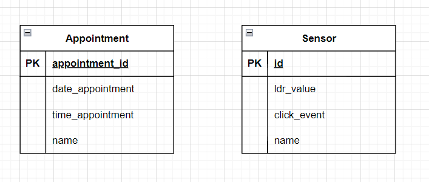
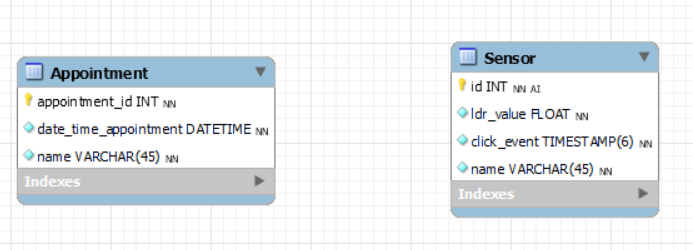

# Database

I designed two tables for my database. The first table is the Appointment table. In this table I will be saving the date,
time and name of the appointment. I also have an 
AI id, so it keeps going up for every new appointment. The second table is the Sensor table. This table is for the sensors
I am using. In this table I will be saving the light value of the LDR, the timestamp of when the user clicks on a button 
and the name of the sensor. 

