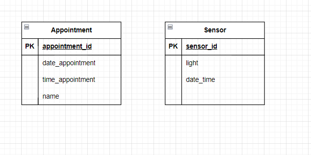
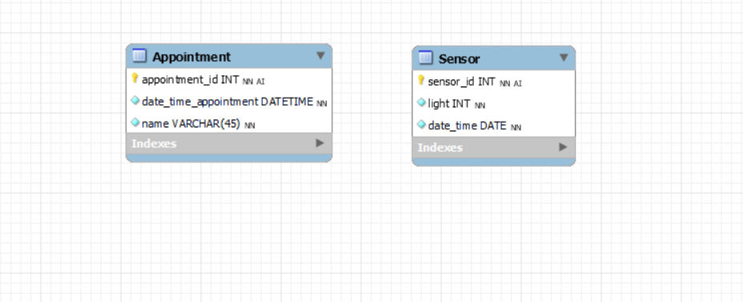

# Database

## Introduction 
I designed two tables for my database. The first table is the Appointment table. In this table I will be saving the date and
time and the name of the appointment. I also have an AI id, so it keeps going up for every new appointment. The second table
is the Sensor table and this table also has an AI id so the id keeps going up. In this table I am saving the value of 
the light that LDR detects when it's dark, and I am also saving the exact date and time of when the LDR detects
darkness.

## ERD

## MySQL database

**Reasoning:**
For the `Appointment` table, I chose to save the date and time of the appointment as DATETIME, because they would 
always be stored together. Storing it separately could lead to inconsistencies and needing more storage. The name of the
appointment is a string and that's why I chose to save it as a VARCHAR.

For the `Sensor` table, I chose to save the light value of the ldr as an INT, because in my embedded code the LDR value 
is read as an int and not as a decimal for example. I chose to save the date_time of the sensor as DATETIME, the same 
reason as to why I stored the date_time_appointment that way.

## Table descriptions

### Appointment Table:

**Purpose:** Stores appointment details including date, time, and appointment name.

**Attributes:**

- `appointment_id` (AI): Unique identifier for each appointment.

- `date_time_appointment`: Date and time of the appointment.

- `name`: Name of the appointment.
 
**Key Constraints:** `appointment_id` is the primary key.

### Sensor Table:

**Purpose:** Records light detection data captured by sensor.

**Attributes:**

- `sensor_id` (AI): Unique identifier for each sensor entry.

- `light`: Value of light detected by the sensor.

- `datetime`: Date and time of light detection.

**Key Constraints:** `sensor_id` is the primary key.

## Candidate keys

For the `Appointment` table I chose to create an auto increment id, because each appointment entry will be unique, and it 
serves as an identifier for each appointment. I could have created a composite key of the `date_time_appointment` and the
`name`, but that could lead to complexity and data redundancy issues, because there could be appointments with the same 
date and name for example. The same goes for if I had only `date_time_appointment` as primary key or `name`. That's why
I chose to have the AI `appointment_id` as the primary key. 

For the `Sensor` table I also chose to create an auto increment id, because here too, each sensor entry will be unique
because of the id. Again here, making a composite key or use `light` or `date_time` as primary key would lead to complexity
and redundancy issues. That's why I decided to use the AI `sensor_id` as the primary key.

Overall these primary keys are unique, stable, efficient and don't lead to any unnecessary complexity or redundancy issues.

## Sql script

