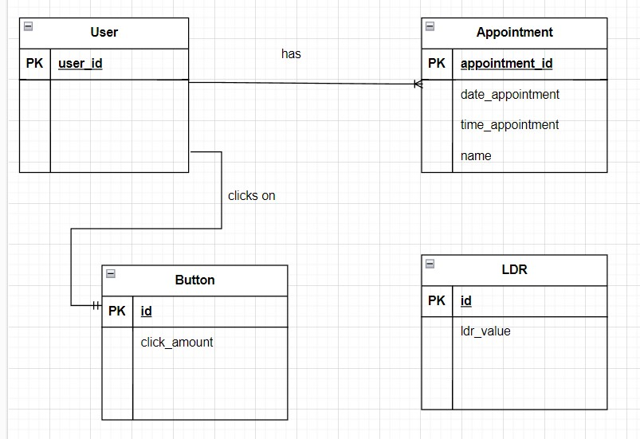
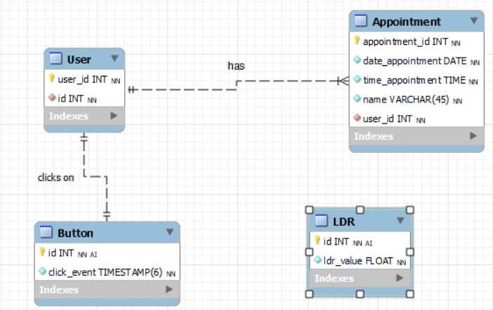

# Database

I designed four tables for my database. I have one table called User and in this table I will be saving the id of the user.
There is only one user, so I have the id on 1. I did this because it's easier to link the data to the one user. The second 
table is the Appointment table. In this table I will be saving the date, time and name of the appointment. I also have an 
AI id, so it keeps going up for every new appointment. The third table is the Button table. This table is for the push button
sensor and in here I will save the exact time of when the user clicks on the button. The last table is the LDR table. This 
table is for the LDR sensor and in this table I will be saving the numerical value of the brightness level.

