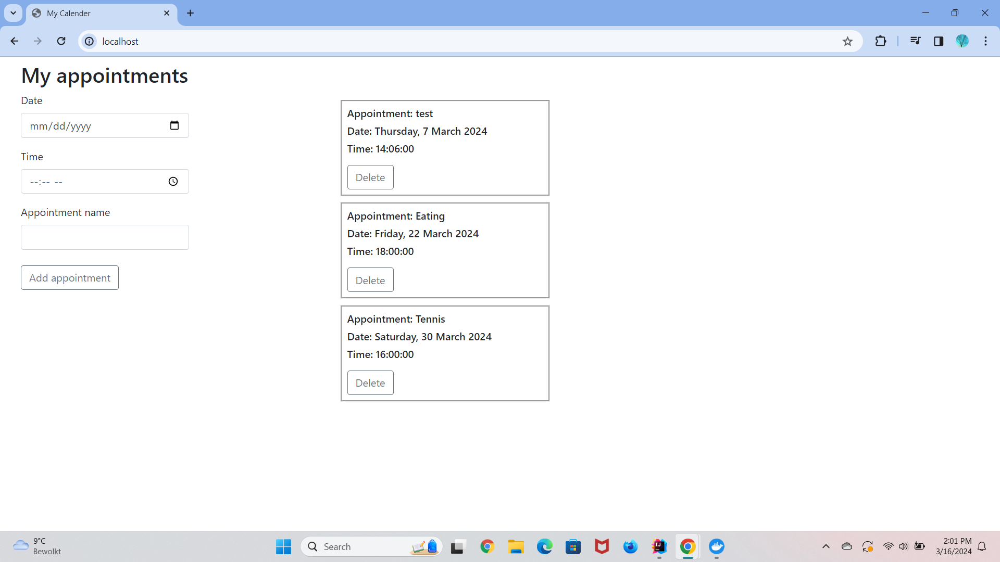

# Technical Documentation

## Web design

Before I started working on my website, I decided to make a prototype of how I wanted the website to look. My initial 
thought was, that I wanted to keep my website as simple as possible. Below you'll find a link to the figma file:

```https://www.figma.com/file/g4dI9OH31KGHutvmj3fl4s/initial_web_design?type=design&t=aWeDlRgMY2tzEiAV-6```

But after this I didn't really like the colours and the way it looked on the page, so I changed the page a little. The 
page ended up looking pretty empty and didn't have any colours. It just didn't look like a typical website, but it did
have the functionalities. You could create an appointment, see all the appointments and delete them too. Below you'll 
find a picture of how it looked like:



I did my research about websites and I wanted to know how I could improve the user interface for people with no IT-background.
I let four users test out my website and received feedback from them. They said the website looked pretty empty and 
there were no colours at all. It just needed a little more decoration, because it didn't look like a typical website 
you would see every day. I wanted the website to have some colours and look fun, but to also have a professional look 
to it. So, I searched for some "professional" colours and I found the colour taupe. I really liked the colour taupe, 
so I implemented this in my website. I used it for my header and for the colour of my buttons.

During the testing I also noticed that the users had to look carefully in the left corner of the page, because the form 
was very small, so I decided to bring it more to the middle of the page and to make the input fields longer. Something 
I also noticed was that the more appointments were made, the longer the page got, so I decided to add a scroll bar to 
the list of cards, that way it's easy to see all the appointments without the page having to be very long. 

The main focus of the website, is that you can create appointments, see them and delete them. So I didn't find it 
necessary to make a homepage for example. I also explained the use of this website in a fun way in the header itself.
Below you'll find a picture of how the website looks like now:


The software I used for my website is Intellij, MySqlWorkbench, and the docker environment. The front-end consists out of 
HTML, CSS and JavaScript and the back-end consists out of PHP. In the beginning of the project I did consider using 
Visual studio code, but I thought that wouldn't be necessary because I could do the exact same thing in Intellij, 
also because I know how Intellij works. I also thought that instead of using PHP, I could create a kind of like OOP 
framework, because I didn't know how to use PHP. But I thought it would be better to use PHP, because then I'd get to 
also learn a new programming language. 


## Functionalities

To be able to submit the form, I used a button. On the button, I used a click event and when the user clicks on the 
button. `handleAppointmentSubmission()` will be called. In this function I validate the fields based on if they were empty
or if the appointment name is bigger than 16 characters. I have chosen to validate each field separately, because I wanted
the users to get a clear message of what is missing or needs to be changed. Below you can see how I did it: 

```javascript
        let dateField = document.getElementById("date-input");
        let timeField = document.getElementById("time-input");
        let nameField = document.getElementById("app_name");
        let dateInput = dateField.value;
        let timeInput = timeField.value
        let nameInput = nameField.value;

        if (dateInput === '') {
            errorMsg.innerHTML = "Date cannot be empty!";
            errorMsg.style.display = "block";
        } else if (timeInput === '') {
            errorMsg.innerHTML = "Time cannot be empty!"
            errorMsg.style.display = "block";
        } else if (nameInput === '') {
            errorMsg.innerHTML = "Name cannot be empty!";
            errorMsg.style.display = "block";
        } else if (nameInput.length > 16) {
            errorMsg.innerHTML = "Name has to be between 0-16 characters";
            errorMsg.style.display = "block";
        } else {
            let dateTimeAppointment = dateInput + ' ' + timeInput
            let appointment = {
                "dateTimeAppointment": dateTimeAppointment,
                "name": nameInput
            };
        }
```

Above you can see that the moment everything is correct, an object is made out of the values and this will be sent to the
database by using the PHP file `insert_data.php`. Below you can find how I did it:

```javascript
        fetch("insert_data.php",
                {
                    "method": "POST",
                    "headers": {
                        "Content-Type": "application/json; charset=utf-8"
                    },
                    "body": JSON.stringify(appointment)
                }).then(function (response) {
                return response.json();
            }).then(function (data) {
                createAppointments();
                successMsg.innerHTML = "Your appointment has been added!" + `<span class="close">&times;</span>`;
                successMsg.style.display = "block";
                let closeButton = document.querySelector('.close');
                closeButton.addEventListener('click', function () {
                    successMsg.style.display = 'none';
                    dateField.value = '';
                    timeField.value = '';
                    nameField.value = '';
                });
            });
```

In the options I sent the method, headers and body. You can see that I sent the object as the body. When the appointment
is created it will be immediately added to the list of appointments. You will also see a message that displays that the 
appointment has been added. The message also contains a close button that removes the message and clears the input
fields, so the users can add new appointments immediately. 

The reason why I chose to use Fetch API is because I am familiar with it. I have used it in another projects and by using
Fetch API I can easily create HTTP requests. While other options do exists, I wanted to use this because I already know
how it works.


## API endpoint

After the request is sent, it will end up here in the backend and the request will be handled by PHP. The object is 
deserialized into separate variables, so I can add the values in the INSERT query. To prevent SQL injection, I replaced
the variables in the `VALUES()` with question marks (?), and I then bound the parameters with the variables. The query is
executed and a message will be sent. Below you'll find how the request is handled:
```injectablephp
$data = file_get_contents("php://input");
    $appointment = json_decode($data, true);
    define('HTTP_STATUS_CREATED', 201);
    define('HTTP_STATUS_INTERNAL_SERVER_ERROR', 500);

    if ($appointment !== null) {
        $dateTimeAppointment = $appointment["dateTimeAppointment"];
        $name = $appointment["name"];

        if (isset($dbConnection)) {
            $insertQuery = $dbConnection->prepare("INSERT INTO `Appointment` (`date_time_appointment`, `name`) VALUES (?, ?)");
            $insertQuery->bind_param("ss", $dateTimeAppointment, $name);
            if ($insertQuery->execute()) {
                http_response_code(HTTP_STATUS_CREATED);
                echo json_encode(array("succes" => true, "message" => "Appointment is added succesfully!"));
            } else {
                http_response_code(HTTP_STATUS_INTERNAL_SERVER_ERROR);
                echo json_encode(array("success" => false, "message" => "No connection with database",
                    "error" => $dbConnection->error));
            }
```

## MysqlWorkbench

When the request was successful and the data is sent to the database, the data will be added to a table called Appointment.
This table exists out of an AI id, date_time_appointment column and a name column for the appointment. Below you'll find
a picture of how it looks like:


## Docker environment and their roles

**1. Tunnel**

The tunnel creates a safe way for users outside my system to connect to it. It's like a secured tunnel for authorized 
systems to interact with my websites from far away. 

**2. iot-nginx**

This container is used, so users are directed to the right parts of my website quick and efficient. 

**3. iot-php**

The PHP container handles the requests of my website. It makes sure users can create an appointment, getting data, deleting
data and overall makes sure the website works smoothly

**4. iot-phpmyadmin**

This container is used to help you control and manage the data from the website

**5. iot-mariadb**

This container makes sure all of my appointments are saved and secured and that I can access them whenever I want

## Testing 

**1. Create new appointments**

- I create new appointments to see if everything works
- I make sure that you can enter all the values and when you click on the submit button, the appointment is added to 
the list. 

**2. Delete appointment**
- I delete appointments to see if they stay deleted
- I make sure that there is a button that deletes the appointment, and when you delete it, it stays gone for good.

**3. Seeing the appointments**

- I make sure I can see the appointments that I have created already
- I make sure that when they show up, they have the name, date and time of the appointment


